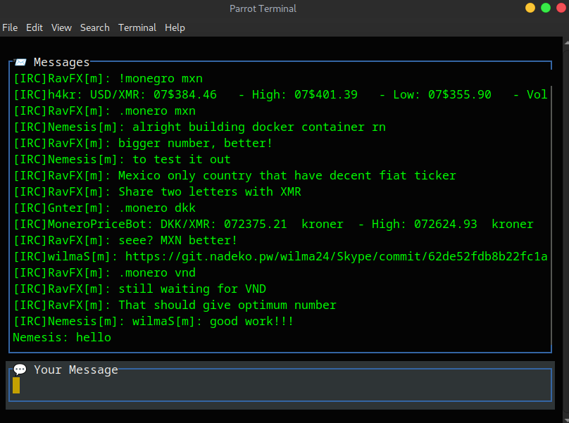

  <a href="README.md">🇺🇸 English</a> |
  <a href="README_TR.md">🇹🇷 Türkçe</a>

# Amnezichat_TUI

## RAM-only secure messenger with terminal user interface
<!-- DESCRIPTION -->
## Description:

RAM-only secure messengers offer enhanced privacy and security by minimizing data persistence and exposure. A RAM-only system ensures that all user data, including messages and encryption keys, are stored temporarily in volatile memory (RAM) rather than on a hard drive, which significantly reduces the risk of data retrieval after shutdown or compromise.

<!-- FEATURES -->
## Features:

- Quantum-resistant E2E message encryption

- Forward and backward secrecy for one-to-one chats

- Group chat support using PSK (pre-shared-key)

- Server runs even on cheapest hardware

- Each message is stored encrypted in server's RAM and wiped after 10 minutes

- Tor/I2P routing support

- Docker support

- Built in Rust

## Comparison chart with other messengers:

| Feature                  | **Amnezichat**         | **Signal**            | **Simplex**           | **WhatsApp**                    | **Telegram**           | **Cwtch**             |
|--------------------------|---------------------------|---------------------------|---------------------------|-------------------------------------|---------------------------|------------------------------|
| **Ephemeral Messages**   | Fully ephemeral          | Optional                  | Fully ephemeral           | Optional                            | Optional                  | Fully ephemeral              |
| **Encryption**           | Quantum-resistant E2EE     | Quantum-resistant E2EE    | Quantum-resistant E2EE    | Signal Protocol *(closed-source)*  | Partial                   | Tor-based E2EE               |
| **Forward Secrecy**      | ✅ Yes                     | ✅ Yes                    | ✅ Yes                    | ✅ Yes                              | ⚠️ Partial               | ✅ Yes                        |
| **Traffic Routing**      | 🔄 Optional (Tor/I2P)      | ❌ No                     | 🔄 Optional               | ❌ No                               | ❌ No                      | ✅ Over Tor                  |
| **Data Retention**       | 🗑️ None                   | 🗑️ None                  | 🗑️ None                  | ❌ Metadata retained                | ❌ Metadata/cloud sync   | 🗑️ None                      |
| **Group Chat**           | ✅ Yes         | ✅ Yes                    | ✅ Yes                    | ✅ Yes                              | ✅ Yes                    | ✅ Yes                        |
| **FOSS (Open Source)**   | ✅ Yes                     | ✅ Yes                    | ✅ Yes                    | ❌ No                               | ❌ No                     | ✅ Yes                        |
| **Self-Hosted**        | ✅ Yes                     | ❌ No                     | ✅ Yes                    | ❌ No                               | ❌ No                     | ✅ Yes                        |
| **Server Requirements**  | ✅ Low-cost hardware       | ❌ Moderate               | ❌ Moderate               | ❓ Unknown                              | ❓ Unknown         | ✅ Peer-to-peer only         |

## Technical details:

- Defense against AI-guided Traffic Analysis (DAITA) by sending encrypted dummy data at random intervals and padding all messages to a fixed length except files

- [Amnezichat Protocol](PROTOCOL.md) for end-to-end encryption
- Stores identity keys in local storage encrypted with ChaCha20-Poly1305 and Argon2id KDF with an user specified password

### Amnezichat Protocol:
- EdDSA and Dilithium5 for authentication, ECDH and Kyber1024 for key exchange, encryption using ChaCha20-Poly1305

<!-- INSTALLATION -->
## TUI Client setup:

    sudo apt update
    sudo apt install curl build-essential git tor xterm
    sudo systemctl enable --now tor.service
    curl https://sh.rustup.rs -sSf | sh -s -- -y
    git clone https://git.disroot.org/Amnezichat/Amnezichat_TUI.git
    cd Amnezichat_TUI/client/
    cargo build --release
    cargo run --release

## TUI Client setup with Docker:

    sudo apt update
    sudo apt install docker.io git
    git clone https://git.disroot.org/Amnezichat/Amnezichat_TUI.git
    cd Amnezichat_TUI/client/
    docker build --network=host -t amnezichat_tui .
    xhost +local:docker
    docker run --rm -it \
    --network=host \
    -e DISPLAY=$DISPLAY \
    -v /tmp/.X11-unix:/tmp/.X11-unix \
    --env QT_X11_NO_MITSHM=1 \
    amnezichat_tui:latest

## Requirements:

- [Rust](https://www.rust-lang.org), [Tor](https://gitlab.torproject.org/tpo/core/tor), [I2P](https://i2pd.website/)

<!-- SCREENSHOT -->
## Screenshot:

<!-- MIRRORS -->
## Git Mirrors

You can access **Amnezichat_TUI** source code from multiple mirror repositories:

- 🔗 **[Disroot Main Repository](https://git.disroot.org/Amnezichat/Amnezichat_TUI)**
- 🔗 **[GitHub Mirror](https://github.com/Amnezichat/Amnezichat_TUI)**

<!-- LICENSE -->
## License

Distributed under the GPLv3 License. See `LICENSE` for more information.

## Donate to support development of this project!

**Monero(XMR):** 88a68f2oEPdiHiPTmCc3ap5CmXsPc33kXJoWVCZMPTgWFoAhhuicJLufdF1zcbaXhrL3sXaXcyjaTaTtcG1CskB4Jc9yyLV

**Bitcoin(BTC):** bc1qn42pv68l6erl7vsh3ay00z8j0qvg3jrg2fnqv9
